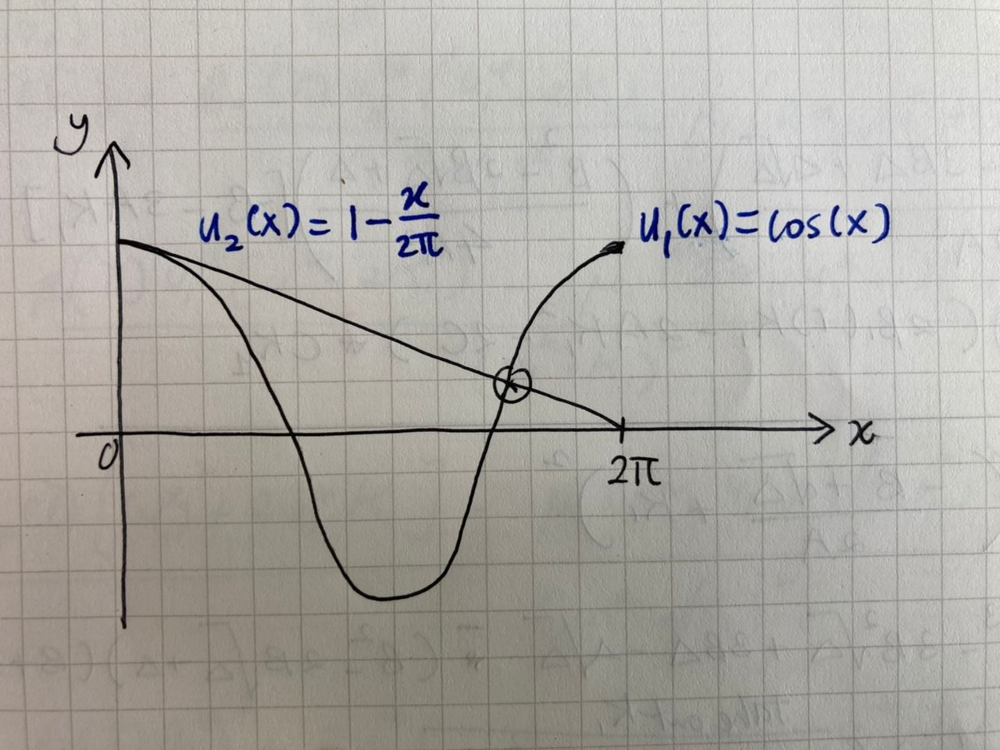
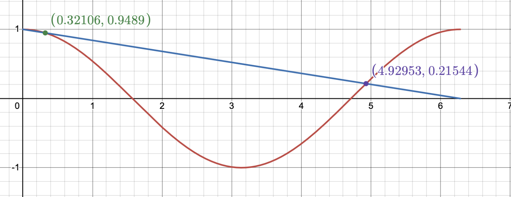

During my PhD year, I was a part-time Additional Mathematics tutor during my free time. I have encountered several questions, ranges from easy to hard, and there was this one question that keep lingering in my mind for quite sometime. To me, it was not hard, but I kept thinking how would I explain it _better_ to my student if I were given a second chance to re-explain it again. Now, while waiting an email on my thesis submission, I can _properly_ revisit the question again —with peace from the never-ending thesis writing process— to reiterate my approach to the problem.

### Part 1: That one question in my mind
The question is from the Trigonometric Ratios topic.

>Consider two equations:
>
>$$ \begin{aligned} u_1(x) &= \cos (x)   \\ 
u_2(x) &= 1 - \frac{x}{2\pi} 
\end{aligned} $$
>
>that are defined within the interval of $$0<x<2\pi$$. Sketch the two equations in the same graph and determine the number of intersections between the $$u_1(x)$$ and $$u_2(x)$$.

When my student first **sketched** the solutions, he said that there was only _one_ intersection between the two equations.  (Here, the keyword is _sketch_ because it was supposed to be a rough drawing).  Below shows a drawing by me, a depiction how it was drawn by my student last time:

Often, the sketching process for linear equation uses the approach of determining the intercepts and the endpoints  and connect all of them to form a straight line. And, that was what my student did.

However, my not-so spidey sense informed me that there was supposed to be one more intersection in the vicinity of the $$x=0$$. So, to be sure, my student and I checked through [Desmos](https://www.desmos.com/calculator) , and we found that there was indeed another intersection at $$(x,y)=\left(0.32106,\ 0.9489\right)$$ .

### Part 2: A tidbit of Analysis _recap_?

Let us begin with a _motivation_:
> (Informal) Motivation: To prove there is indeed an intersection point at the interval of $$[0,\pi/2]$$.

_Remark:_ Why the need to restrict on the interval $$[0,\pi/2]$$? Consider we are interested on finding exactly one more intersection at the suspected interval, we might as well (ab)use some theorems from Analysis. 

_Proof_ .  Suppose that the $u_1(x)$ and $u_2(x)$ are continuous in the interval of $$[0,\pi/2]$$ , and are sufficiently differentiable in $$(0,\pi/2)$$. Additionally, it is given that:

$$
\begin{aligned}
u_1(0)&=u_2(0)=1, \\
u_1(\pi)&<0, \,\, u_2(\pi)>0,\\
u_1'(0)&=0,
\end{aligned}
$$

and 

$$ u_1''(x)<0, \,\,\,\,\,u_2'(x)=-c,$$

for all $$x$$ in the interval of $$[0,\pi/2]$$, where $$c$$ is a positive constant. We define a function of $f(x)$ such that:

$$ f(x)=u_1(x)-u_2(x)$$

From the Definition (1), it can be shown that at the endpoints of the interval:

$$
f(0)=0  \hspace{5mm} \text{and}  \hspace{5mm} f(\pi/2)<0.
$$

Differentiate (1) with respect to $x$:

$$ f'(x)=u_1'(x)-u_2'(x), $$

and at $x=0$, 

$$
\begin{aligned}
f'(0)&=u_1'(0)-u'_2(0),\\
&= 0-(-c)\\
f'(0)&=c  \\
&>0.
\end{aligned}
$$

Since $$f'(0)>0$$, then there exist $$k \in [0,\pi/2]$$ such that $$f(k)>f(0) \Longrightarrow f(k)>0$$ . Thus, there exist positive $f$ in the interval of $$[0,\pi/2]$$. Then, with $$f(k)>0$$ and $$f(\pi/2)<0$$ (alternating sign), we can use Intermediate Value Theorem (IVT) that shows that there exists at least one $$p \in [0,\pi/2]$$  such that  

$$f(p) = 0.$$

Consider $$f''(x)$$ is strictly concave, then we can assert that there is only one $$p \in [0,\pi/2]$$. Ultimately, 

$$ u_1(p)=u_2(p)$$

which means there exist an intersection between $$u_1(x)$$ and $$u_2(x)$$ in the interval of $$[0,\pi/2]$$.      $$\square$$

## Part 3: Closing remark

The intention of the initial proof is to prevent from differentiating the function directly since I am _trying_ to put myself in my student's shoes; the differentiation of trigonometric ratios is not taught in the Additional Mathematics syllabus. 

So does Analysis. _Sike!_

Nonetheless, I definitely enjoyed writing out the proof. It felt like a quick trip back to my third year days, reminiscing all the "_for all_ $\varepsilon>0$, _there exists_ $\delta$" in my analysis homework. _Till then!_
